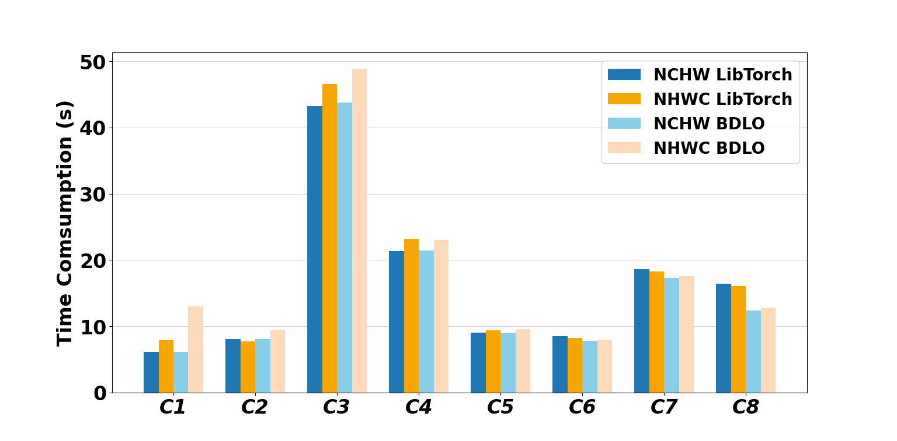
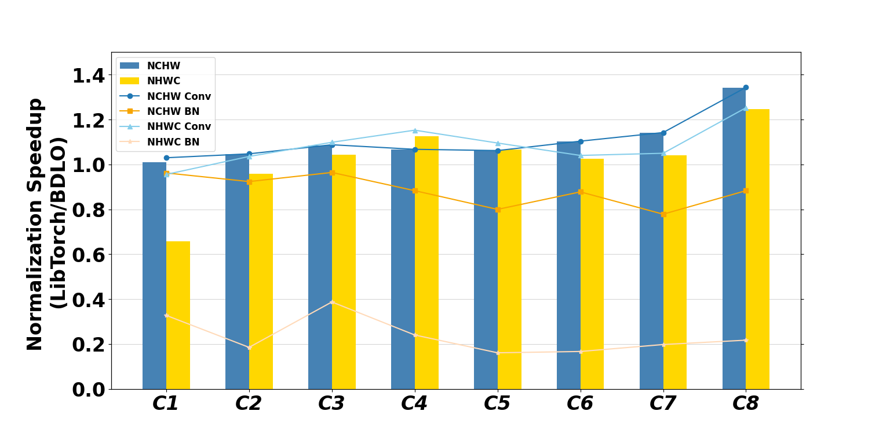
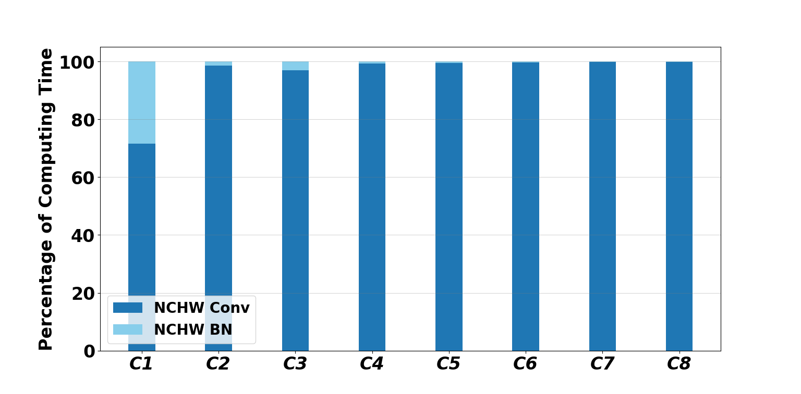

# Matplotlib-Visualization-Enhancements
A collection of Python scripts showcasing enhanced visualization techniques using Matplotlib. This repository features customizations such as axis adjustments, style enhancements, and the integration of Pandas for data-driven charting. Ideal for researchers and developers looking to beautify their data presentations.

Results Showcase:👇

